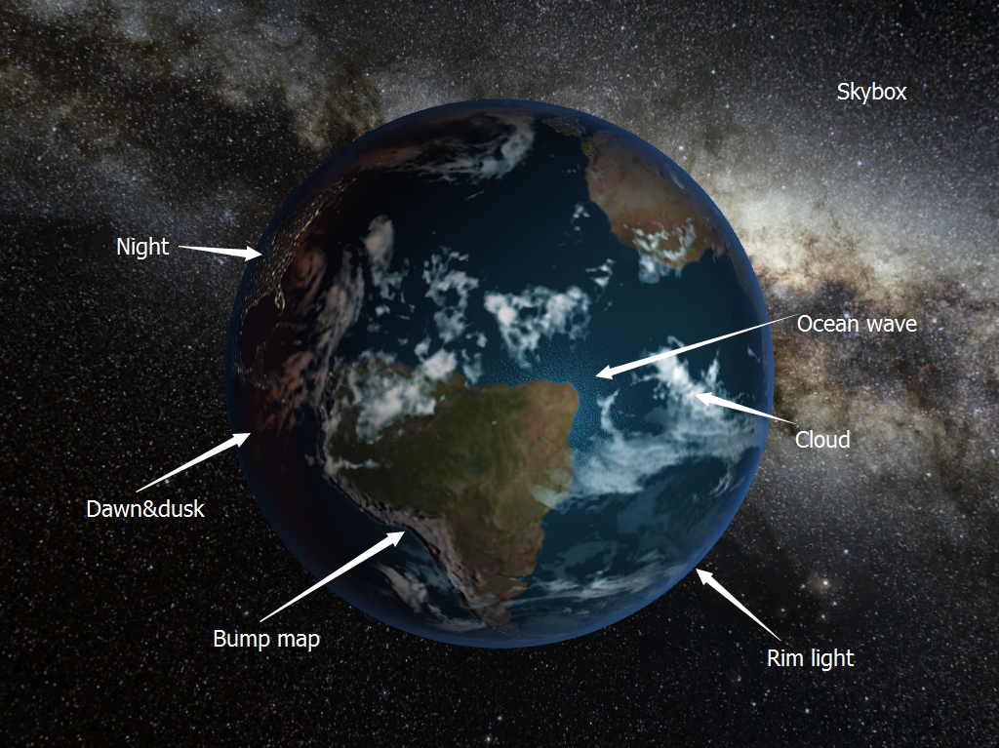
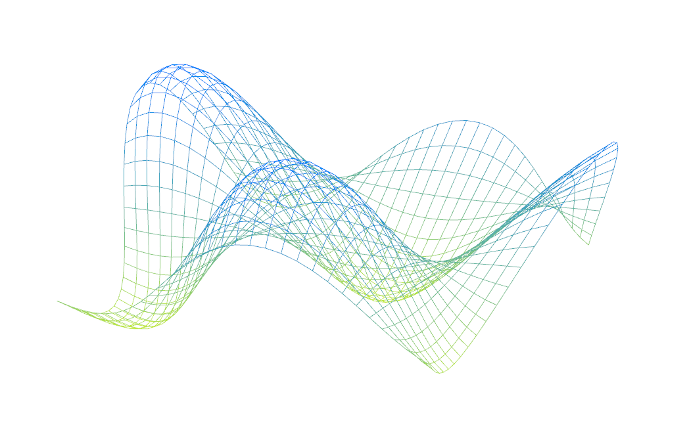
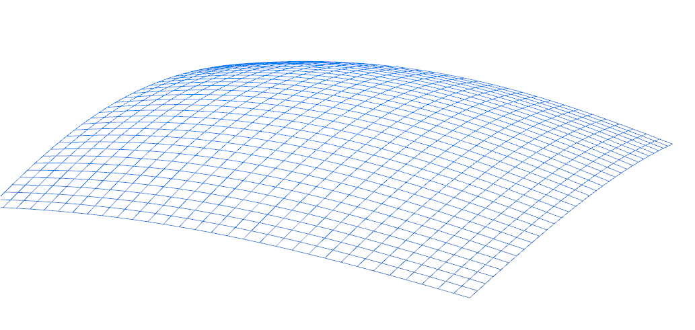
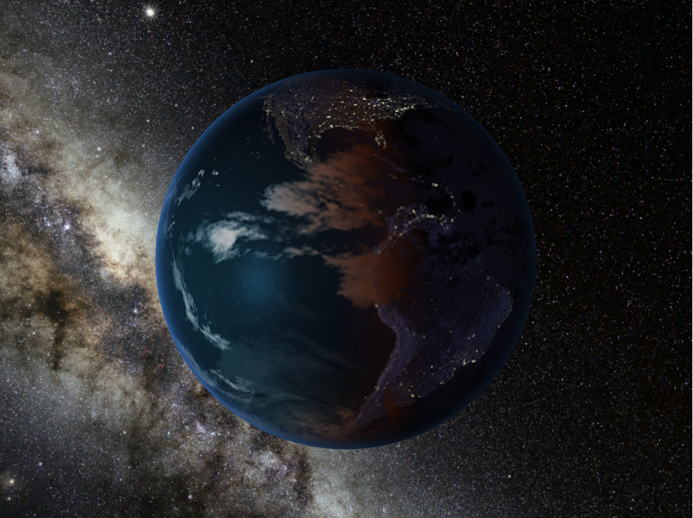
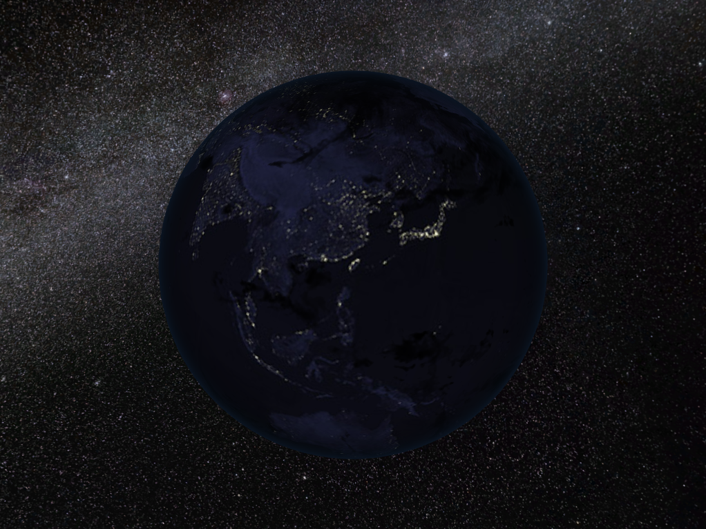

-------------------------------------------------------------------------------
CIS565: Project 5: WebGL
-------------------------------------------------------------------------------
Fall 2014

-------------------------------------------------------------------------------
Playable WebGL demo:
http://cyborgyl.github.io/Project5-WebGL/

In Part 1, you are given code for:

* Drawing a VBO through WebGL
* Javascript code for interfacing with WebGL
* Functions for generating simplex noise

You are required to implement the following:

* A sin-wave based vertex shader:

* One interesting vertex shader of your choice

-------------------------------------------------------------------------------
PART 2 REQUIREMENTS:
-------------------------------------------------------------------------------
In Part 2, given code:

* Reading and loading textures
* Rendering a sphere with textures mapped on
* Basic passthrough fragment and vertex shaders 
* A basic globe with Earth terrain color mapping
* Gamma correcting textures
* javascript to interact with the mouse
  * left-click and drag moves the camera around
  * right-click and drag moves the camera in and out

Features implemented:

* Bump mapped terrain
* Rim lighting to simulate atmosphere
* Night-time lights on the dark side of the globe
* Specular mapping
* Moving clouds

You are also required to pick one open-ended effect to implement:

* Procedural water rendering and animation using noise 
* Draw a skybox around the entire scene for the stars.
* Dawn and twillight color blending

Figure 0. Completed globe renderer, daylight side.

Figure 1. Completed globe renderer, twilight border.

Figure 2. Completed globe renderer, night side.

#PERFORMANCE EVALUATION
---
Always 60 fps on Desktop PC with GTX780, notebook with GT650M, or iphone 5s.
---
#Third Party Code
-In drawing skybox, cube vectices and index matrix from http://en.wikibooks.org/wiki/OpenGL_Programming/Modern_OpenGL_Tutorial_06
